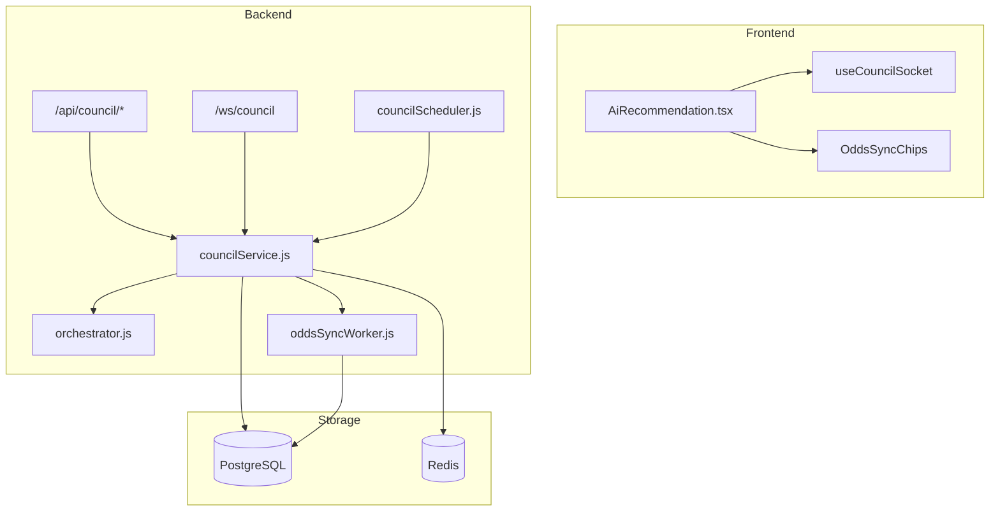

# HKJC AI Council 功能與本輪開發摘要

> 文件日期：2026-07-08  
> 涵蓋範圍：AI 議會（LLM Council）真互聊會議室、即時 WebSocket、賠率同步聯動、Kelly 秘書、Lead Analyst 主席、可調回合間隔，以及本 chat 期間修復的穩定性問題。

---

## 1. 產品定位

**AI Council** 是 HKJC Dashboard 的「開跑前即時分析會議室」：

- 針對**單一場次**（`meeting_date` + `venue_code` + `race_no`）進行多 agent 回合制討論。
- 結合 **PostgreSQL 歷史數據**、**即時賠率快照**、**Odds Momentum** 等上下文。
- 由 **Lead Analyst（首席分析師）** 每輪產出共識 picks（QPL / 多產品 others）與下輪指令。
- 使用者以 **Council Member** 身份發言；**Kelly 秘書**負責回應問題與轉達指令。
- Backend **持久化 session**；關閉瀏覽器後會議仍可繼續，重連 WebSocket 即可追蹤。

---

## 2. 系統架構（高層）



| 元件 | 職責 |
|------|------|
| `councilService.js` | Session 生命週期、訊息持久化、回合觸發、賠率 sync arm/disarm、Redis 設定 |
| `orchestrator.js` | 單輪 chatroom：分析師依序 → Kelly（若有 user 發言）→ Lead Analyst JSON 總結 |
| `councilScheduler.js` | 定時 tick：自動開會（可選）、執行回合、補 arm 賠率同步 |
| `councilWs.js` | WebSocket：即時 typing、訊息、cadence、round_gap、picks |
| `agents.js` | 六角色 system prompt 與模型設定 |
| `picksSchema.js` | 共識 JSON 校驗（含 WIN/PLA/QIN/FCT/TCE/TRI/FF/QTT 等） |

---

## 3. AI 角色（6 人）

| Code | 顯示名 | 職責 |
|------|--------|------|
| `quant` | Quant | 量化、資金流、賠率結構 |
| `historian` | Historian | 往績、場地適性（模型：`deepseek-chat`，避免 reasoner 截斷） |
| `trend` | Trend | 市場情緒、Odds Momentum（含 HKT 時間與 NEW/OLD drop 規則） |
| `scout` | Scout | 現場檢核、陣上變數 |
| `kelly` | Kelly | **會議秘書**：回答 user 問題、轉達合理指令給主席、婉拒無理要求 |
| `bookie` | Lead Analyst | **主席**：成員評判、裁決、directives、動態 confidence、共識 picks |

### Kelly 發言規則

- **時機**：每輪四位分析師發言後、Lead Analyst 總結**之前**（僅當該輪有未處理 user 發言）。
- **問題** → 依 MeetingTranscript 回答，註明引用來源。
- **指令** → 回覆末尾單行：`>> 轉達首席：<任務>`（只影響**下一輪** directives）。
- **不合理指令** → 俏皮婉拒，不輸出轉達行。

### Lead Analyst 領導力輸出（JSON）

- `member_verdicts`：adopt / partial / reject
- `ruling_zh`：打破僵持
- `directives`：下輪每位成員具體任務
- `confidence`：每輪重新計算
- `current_picks`：QPL + others（4–5 種不同 product）

---

## 4. 單輪會議流程（Chatroom Round）

```
Round N 開始
  → quant → historian → trend → scout（依 next_sequence 或預設順序）
  → [Kelly：若有 pending user messages]
  → Lead Analyst：JSON 總結 + picks + directives
  → 寫入 DB、廣播 WS、更新 Live 共識卡
  → 等待「回合間隔」後 Round N+1（或 user 發言 force 立即開輪）
```

**終止條件**

- 賽事狀態 **開跑**（`isRaceStartedStatus`，含 API 關鍵字「開跑」）→ 立即停止。
- 開跑前 **1 分鐘** → FINAL 結案。
- 手動停止、賽事結束等。

---

## 5. 本 chat 主要功能與改動

### 5.1 即時聊天 UX

- WebSocket 事件附 `_seq`，前端依序處理，避免需整頁刷新。
- **Typing 指示**：`typing_update` → 聊天列表底部插入「…」氣泡。
- **Smart auto-scroll**：黏底 / 向上閱讀時顯示「跳到最新」與未讀計數。
- **OddsSyncChips**：AI 頁與 Realtime 頁顯示賠率 worker 狀態。

### 5.2 會議控制

| 功能 | 說明 |
|------|------|
| 啟動 / 停止 / 恢復 | 手動停止的 session 可「啟動議會」延續（非 scheduler 自動復活） |
| 全日自動開會 | 按鈕預設**關**；開啟後當日各場開跑前自動 `startCouncilSession`（Redis `council:activated:{date}`） |
| 可調回合間隔 | UI 15–600 秒；存 Redis `council:round_gap_ms`；倒數「下一輪約 X 秒後開始（間隔 Y 秒）」 |
| Session 自動切換 | 前端若偵測更高 `session_id` 的 active session，自動跟隨新會議 |

### 5.3 賠率同步聯動

- **設計**：議會開始 → `armIntervalForRacesMerged(本場)`；議會停止 → `removeIntervalTargets(本場)`。
- **修復**：Backend 重啟後 in-memory targets 消失但 DB session 仍在 → `hydrateActiveSessionsFromDb` 與 scheduler 每 tick 呼叫 `ensureOddsSyncForActiveSessions()` 補 arm。
- UI：議會進行中但尚未 arm 時顯示「同步啟動中」，避免誤導「待命／未同步」。

### 5.4 Prompt 與輸出品質

- 分析師**不再代答** user（由 Kelly 統一）。
- 反重複規則、縮短 transcript window、Trend/Scout 硬性 anti-repetition。
- `picksSchema`：ordered products（FCT/TCE/QTT）保留順序；others 允許 2–6 筆、鼓勵 4–5 種 product。
- Odds Momentum 區塊加 HKT 時間與 drop 年齡（NEW/OLD）。

---

## 6. 已修復 Bug（本 chat 重點）

| 問題 | 根因 | 修復 |
|------|------|------|
| 第一輪結束後第二輪不開始 | 雙重 cadence（scheduler `nextRoundAt` + service gap）衝突 | 統一由 `runCouncilRoundForRace` 的 min-gap 控制 |
| 重啟後會議被 kill | `meeting_date` Date 物件 stringify 成 `Wed Jul 08` | `toYmdDate()` 正規化為 `YYYY-MM-DD` |
| 新 session 訊息不顯示 | 前端 `sessionId` 釘死在舊 id | 自動 adopt 更高 active `session_id` |
| 賠率顯示待命但會議進行中 | 重啟後未 re-arm sync targets | `ensureOddsSyncForActiveSessions` |
| Login 502（dev） | Backend 未用 dev compose 暴露 4000 | `docker compose -f ... dev.yml up -d backend` |
| Maximum update depth | WS handler 連鎖 setState | 事件 cursor、移除高頻 loadSessions 連鎖 |

---

## 7. API 與 WebSocket

### REST（需登入）

| Method | Path | 用途 |
|--------|------|------|
| GET | `/api/council/status` | 議會狀態、active session、latest picks、`round_min_gap_ms` |
| GET | `/api/council/messages` | 歷史訊息 |
| GET | `/api/council/sessions` | 場次 session 列表 |
| POST | `/api/council/start` | 啟動／恢復（`force` 首輪） |
| POST | `/api/council/stop` | 停止 |
| POST | `/api/council/message` | User 發言（`force` 下一輪） |
| POST | `/api/council/activate-date` | 全日自動開會開關 |
| POST | `/api/council/round-gap` | `{ "gap_seconds": 30 }` 設定回合間隔 |
| GET | `/api/council/round-gap` | 讀取目前間隔與 bounds |

### WebSocket ` /ws/council?meeting_date=&venue_code=&race_no=`

| 事件 | 方向 | 說明 |
|------|------|------|
| `session_state` | S→C | 初始狀態 + picks |
| `agent_message` | S→C | 新訊息（含 Kelly / Lead / system） |
| `typing_update` | S→C | 正在輸入 |
| `picks_update` | S→C | 共識卡更新 |
| `cadence_update` | S→C | 倒數用：`last_round_completed_at_ms`、`round_min_gap_ms` |
| `round_gap_update` | S→C | 間隔設定變更 |
| `start` / `stop` / `user_message` | C→S | 控制與發言 |

---

## 8. 環境變數（Council 相關）

| 變數 | 預設 | 說明 |
|------|------|------|
| `COUNCIL_MODE` | `chatroom` | `chatroom` 或 legacy `stage` |
| `COUNCIL_ROUND_INTERVAL_MS` | `30000` | 回合最小間隔（可被 UI/Redis 覆蓋） |
| `COUNCIL_ROUND_MIN_GAP_MS` | 同左 | 與上者二選一 |
| `COUNCIL_SCHEDULER_TICK_MS` | `30000` | Scheduler 嘗試開輪頻率 |
| `COUNCIL_AUTO_START_LEAD_MS` | `300000` | 自動開會：開跑前 5 分鐘 |
| `COUNCIL_CLOSE_BEFORE_START_MS` | `60000` | 開跑前 1 分鐘 FINAL |
| `COUNCIL_MODEL_*` | `deepseek-chat` | 各角色模型 override |
| `ODDS_SYNC_ENABLED` | `true` | 關閉則無法 arm 本場同步 |
| `ODDS_SYNC_LEGACY_FULL_INTERVAL` | `false` | `true` 時 targeted arm 不可用 |

Redis keys：

- `council:activated:{YYYY-MM-DD}` — 全日自動開會
- `council:round_gap_ms` — 使用者設定的回合間隔（毫秒）

---

## 9. 前端頁面（AiRecommendation）

- **狀態列**：場次、RaceTimeContext、會議狀態、倒數 chip、WS 連線、OddsSyncChips。
- **控制列**：啟動／停止、全日自動開會、**回合間隔**（預設 15/30/45/60/90/120 秒 + 自訂）、歷史 session 選擇。
- **複習過往賽馬日**：見 [`AI_COUNCIL_HISTORICAL_MEETINGS.md`](AI_COUNCIL_HISTORICAL_MEETINGS.md)（下拉選單「· 歷史」、Docker 重建、HV/ST 場地）。
- **聊天室**：角色頭像色（Kelly 粉、Lead 紅等）、typing 氣泡、共識卡（含系統修正 badge）。

主要檔案：

```
apps/frontend/src/pages/AiRecommendation.tsx
apps/frontend/src/hooks/useCouncilSocket.ts
apps/frontend/src/hooks/useNowTick.ts
apps/frontend/src/components/OddsSyncChips.tsx
apps/frontend/src/components/RaceTimeContext.tsx
```

---

## 10. Backend 主要檔案

```
apps/backend/src/lib/councilService.js      # Session、回合、Redis、odds arm
apps/backend/src/lib/ai/council/
  agents.js                                  # 六角色 prompt
  orchestrator.js                            # Chatroom 編排 + Kelly turn
  picksSchema.js                             # Picks JSON
  callAgent.js
apps/backend/src/lib/ai/buildRaceContext.js
apps/backend/src/lib/ai/oddsMomentum.js
apps/backend/src/councilScheduler.js
apps/backend/src/councilWs.js
apps/backend/src/routes/council.js
apps/backend/src/oddsSyncWorker.js
```

DB：`hkjc_council_sessions`、`hkjc_council_messages`、`hkjc_council_picks`（見 `schema.sql`）。

---

## 11. 部署與開發備註

**本機 dev backend 重啟（改碼後必做）：**

```bash
docker compose -f docker-compose.yml -f docker-compose.dev.yml up -d --build backend
```

**賽事狀態來源**：`@gikndue/hkjc-api` → `getActiveMeetings()` / GraphQL `horseQuery`（含 postTime、status；「開跑」等關鍵字用於結束會議）。

**Token 節省**：全日自動開會預設關；只有手動啟動或明確開啟 auto-start 的賽馬日才會自動開會。

---

## 12. 馬號來源與後備馬（與 Realtime 共用）

Council context 的 `runners` 來自 `fetchRaceRunnersForRace`（HKJC GraphQL racecard）：

- **合法馬號** = 出賽馬的 `no`（與 WIN/PLA 組合字串一致）。
- **後備馬（Standby）** 的 `no` 為空 → API 回傳 `no: null`、`is_standby: true`；載入 context 時**排除**，不會進入 `RunnersTable` / `validHorseNos`。
- 近績：`horse_code` → 對照本場 `no` 後以 `#馬號 馬名` 呈現（見 `orchestrator.js` 的 `noByCode`）。

Realtime 頁 Race field 對後備顯示 `Back Up`（底部），詳見 `docs/PROJECT_HANDOFF.md` §4.4。

---

## 13. Production WebSocket 備註（Linode / HTTPS）

AI Council 在正式站使用 `/ws/council` WebSocket。

本輪已確認的 production guardrails：

- HTTPS 頁面不可使用 `ws://` / `http://` 作為 `VITE_WS_URL` 目標；前端現已自動回退到同源 `wss://<host>/ws/council`。
- Docker Compose 的 `frontend` 仍是 `vite dev`，所以 proxy 目標必須是 **`backend:4000`**，不能是容器內的 `localhost:4000`。
- Caddy 必須轉發 `handle /ws/council* { reverse_proxy backend:4000 }`。
- Linode 上本專案實際部署路徑曾確認為 **`/root/horse_dashboard`**；若 `deploy` 使用者在 `~/` 找不到 repo，不代表網站沒部署。

若正式站 AI 頁空白且 console 出現：

- `Uncaught DOMException: The operation is insecure`
- `Firefox can’t establish a connection to the server at wss://.../ws/council`

優先檢查：

1. 前端是否已拉到包含 HTTPS WebSocket fallback 的 commit。
2. `frontend` 的 `DEV_PROXY_TARGET` 是否為 `http://backend:4000`。
3. `docker compose up -d --build` 是否在 **`/root/horse_dashboard`** 內執行。

---

## 14. 相關文件

- `docs/AI_COUNCIL_ISSUES_AND_ARCHITECTURE.md` — 早期問題與架構
- `docs/AGENT_HANDOFF_COUNCIL_STABILITY.md` — Agent 交接與驗證清單
- `docs/PROJECT_HANDOFF.md` §4.4 — Racecard 馬號 / 後備馬
- `docs/PROJECT_HANDOFF.md` §4.5 — Production AI 頁 WebSocket
- `.env.example` — Council / Odds sync 變數範例

---

## 15. 後續可選優化

- 倒數與 interval 變更時，可選擇是否重置 `last_round_completed_at`（目前為即時套用新 gap 比較）。
- Kelly / Lead 對 user 指令的 audit log（哪一輪採納／拒絕）。
- 多場同時 running 時 OddsSyncChips 顯示所有 armed targets。
- E2E 測試：一輪完整流程 + WS 事件順序 + re-arm after restart。
